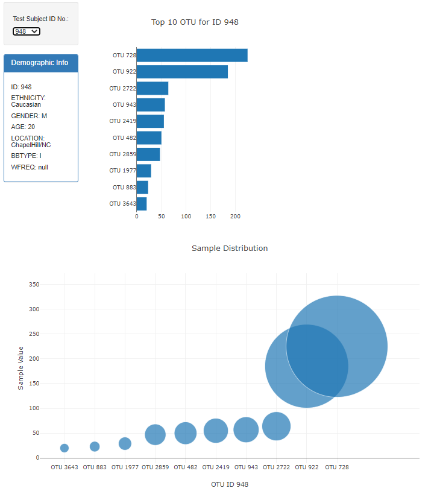

# Plot.ly Homework 

## Belly Button Biodiversity

### The Challenge
This assignment challenges you to build an JS app that will pull data from a samples.json file
to built a dropdown menu to select sample IDs.

The App should then display a Bar chart and a bubble chart for the appropriate selected ID.

### Purpose
To explore the Belly Button Biodiversity dataset which catalogs the mocrobes that colnize human navels.
The dataset reveals that a small handful of microbial species (also called operational taxonomic units, or OTUs, in the study) were present in more than 70% of people, while the rest were relatively rare.

